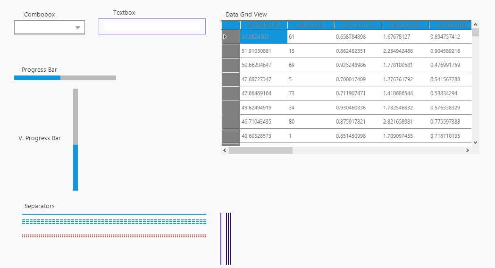
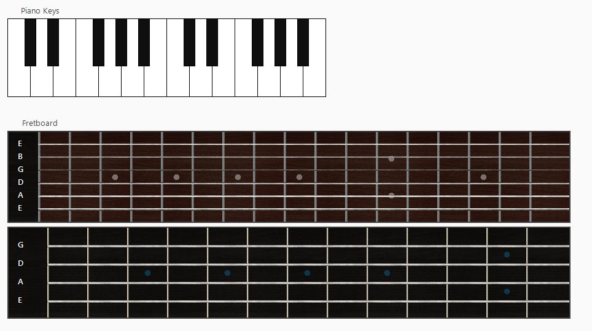
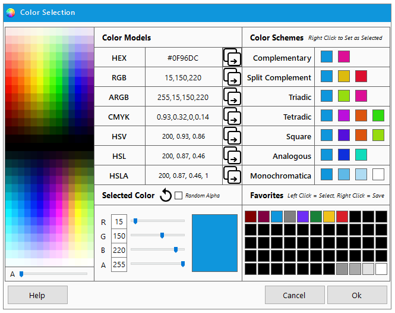

# ErrataUI

A WIP collection of WinForms controls, loosely inspired by WinUI3/Fluent, as well as some other modern design paradigms. Includes a theme manager, custom color dialog, and multiple custom controls.  

Due to the WIP nature of this project, documentation/explanation/instruction of controls, features, etc. is poor... for now.

Buttons 

Containers 

Custom Controls 

Generic Controls 

Music Controls 

Sliders 

Toggles 

Labels 

Default Theme 

Custom Theme Example 

Theme Manager 

Color Dialog 

